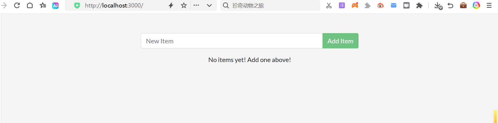
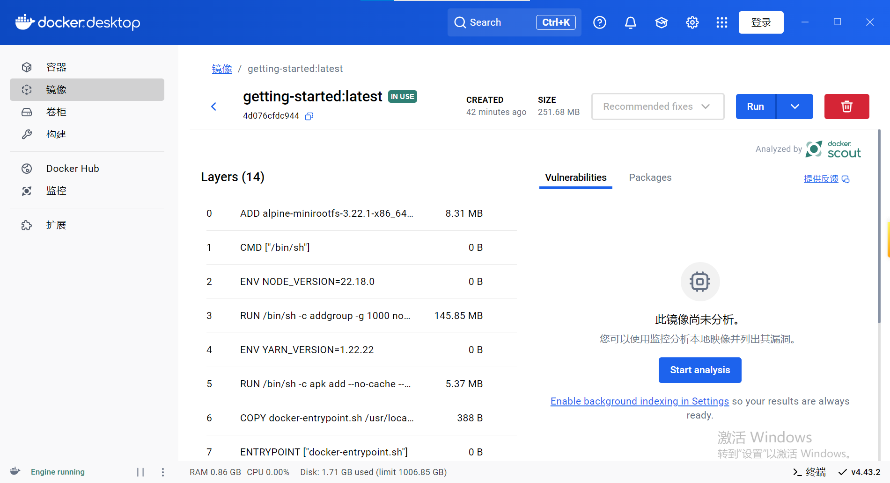

# AWS Guide 中文翻译项目

本文档是 [容器化应用程序](https://docs.docker.com/get-started/) 的中文翻译版本，旨在提供规范、易读的中文技术指南。

---

## 目录结构

- `original.md`：原始英文文档  
- `glossary.csv`：技术术语对照表（中英对应）  
- `CHANGELOG.md`：翻译版本更新记录  
- `translated/`：中文译文目录  
  - `step1.md`：第一章译文（容器化应用程序）  
  - `images/`：本地化截图（中文界面，对应官方占位图）

---

## 本地化截图预览

| 步骤 | 官方占位图 | 中文本地化截图 |
|---|---|---|
| 构建镜像 | — |  |
| 启动容器 | — |  |
| Docker Desktop 容器列表 | — |  |
| 空待办列表 | — |  |
| 添加待办 | — |  |
| 镜像详情 | — |  |

---

## 翻译规范

- 技术术语严格遵循 `glossary.csv` 中的对应关系  
- 代码块、命令、文件名保留英文原样，不可翻译  
- 中文表述符合《微软写作风格指南》（简洁、正式，避免口语化）

## 术语表使用

所有翻译需以 `glossary.csv` 为基准；新增术语须同步至 `CHANGELOG.md`。
